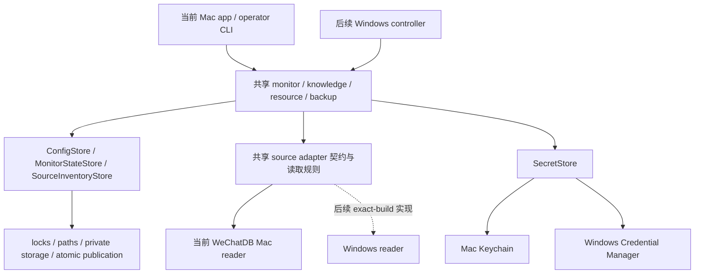

# Windows 开发接手说明

这份文档面向 Windows 适配贡献者，说明现在可以复用什么、下一阶段如何取证和验收。
产品安装与日常使用仍以 [README](../README.zh-CN.md) 为准；逐模块迁移状态以
[port map](WINDOWS-PORT-MAP.md) 为准；状态所有权与验证要求见 [AGENTS](../AGENTS.md)。

## 当前起点

公开 `main` 是共同开发基线。开始工作时记录 `git rev-parse HEAD` 的完整 commit，
每个测试结果绑定该 commit 与实际 OS/Python 环境。合并源码、构建 candidate、安装、
激活运行和真实微信验收是不同事实。

当前已有的基础是：

- macOS/Windows 原生锁、路径身份、private storage 与 atomic publication；
  config、monitor checkpoint、source inventory 已接入。Windows 路径限本地 NTFS。
- API/OAuth 的 native protected secret service：Mac Keychain、Windows Credential
  Manager。Windows CI 使用独立合成凭据测试；不需要提供真实 API key 或 OAuth token。
- 当前 Mac reader 的共享 source 契约与消费者入口见下节。Windows reader 仍待实现。
- optional legacy read-only MCP 与普通 app 的安装、启动和生命周期已经分开。
- mounted backup 保持普通备份路线；Direct Drive 是可选功能，不是 Windows 首轮门槛。

**Windows 应用尚未交付。** Hosted `windows-2022` 的 foundation 测试证明相应系统接口，
不能代替 Windows 11 x64 普通用户环境、指定微信 build、真实 source 的验收。
首轮建议以一台 Windows 11 x64、本地 NTFS、普通交互用户环境为目标；其他 OS/build、
ARM、网络盘和 cloud placeholder source 都须另外验证，不能继承支持声明。

## 共建入口与合并流程

仓库级贡献入口与公共数据边界见 [CONTRIBUTING](../CONTRIBUTING.md)。Windows 共建继续
使用同一个产品与同一条 `main`：贡献者从 maintainer 标记为 ready 的 bounded issue
认领结果，用 fork 的短期 topic branch 提交 Draft PR，不建立长期平行的 Windows domain
分叉。一个 issue 由一个可联系的人类 GitHub identity 负责；agent 可以协助实现，但不
替代任务 owner、机器 owner 或 maintainer 的责任。

从认领到合并使用一条可检查的路径：

```text
ready issue → claimed → Draft PR → synthetic/native foundation tests
→ exact-head review → authorized real-machine evidence（需要时）
→ updated-base CI and finding disposition → maintainer merge
```

PR 必须绑定完整 base/head SHA，交付一个可独立验收的行为变化，并包含实际 caller、失败
路径、必要测试和文档。新提交改变相关代码或 merge base 后，旧 review 与 native receipt
不会自动覆盖新 head。CI 绿色、review 尚未回复、review quota failure 或只审过旧 SHA
均不是同一事实，也不能被写成通过。

真实 source 测试晚于代码审阅，并由机器 owner 对指定 commit 和范围明确同意。登录着
微信的日常电脑不能成为自动执行公共 PR 的 self-hosted runner；hosted CI 不使用真实
source、OAuth/API secret 或聊天数据。公开 evidence 使用 allowlist，只保留 commit、
环境/client build、profile、测试名、pass/fail/not_run、有限错误码和未覆盖项。

GitHub ruleset、required reviewer 与 CODEOWNERS 是独立的 maintainer/account 设置；模板和
源码不能替代它们。本文件只定义贡献与 evidence contract，不表示任何设置已经更改。

## 一个产品，各自的平台实现



`SourceInventoryStore` 是 expected shard set 的唯一写者；`MonitorStateStore` 是
checkpoint/progress 的唯一写者；`ConfigStore` 是 main config 的唯一写者。
Source reader 提供观测、generation、bounded raw pages、canonical envelopes 和
snapshot 失败，不拥有另一份 cursor、队列或 inventory。

当前 `core/wechat_db.py` 仍含 Mac schema、解密 cache 和 query/presentation 实现。
它的 import-safe 分类不意味着可以直接读取 Windows 微信。Windows adapter 须在实际
build/schema 被观察之后实现；不能按表名猜测成功，更不能在未知 schema 下推进 cursor。
`core/source_contract.py` 是 Markdown provenance，和读取来源的 adapter 是不同职责。

Direct Drive 的本机 `drive_scan_shards` ledger 新增默认空值的 `source_cursor_token`；
旧记录与同秒 identity set 保留，队列插入和 token 推进在同一事务中完成。当前 reader
使用有界 keyset page；timestamp-only legacy reader 的兼容请求可能随同秒已见记录增长。
这不改变 remote Drive schema，也不在源码验收时迁移正在运行的用户 ledger。

## 首次接手：运行无私人数据的 foundation 验证

准备 Git 和 Python 3.11 x64，在公开仓库根目录用 PowerShell 执行：

```powershell
git rev-parse HEAD
py -3.11 -m venv .venv
.\.venv\Scripts\python.exe -m pip install -r requirements.txt
.\.venv\Scripts\python.exe -m unittest `
  tests.windows `
  tests.test_repository_layout `
  tests.test_state_storage `
  tests.test_source_adapter.CapabilityTests `
  tests.test_source_adapter.CursorTokenTests `
  tests.test_source_adapter.ErrorVocabularyTests `
  tests.test_source_adapter.InventoryBindingTests `
  tests.test_source_adapter.SourcePageTests `
  tests.test_keychain tests.test_ai_factory `
  tests.test_google_drive_auth.ProtectedRefreshTokenStoreTests `
  tests.test_config.ConfigTests.test_config_store_preserves_concurrent_disjoint_process_updates `
  tests.test_monitor_state.MonitorStateStoreTests.test_two_processes_cannot_replace_the_same_revision `
  tests.test_source_inventory.SourceInventoryStoreTests.test_concurrent_reconcile_preserves_inventory_union_and_revisions
.\.venv\Scripts\python.exe -m compileall -q mcp_server.py ai core ui scripts tests
```

这些测试使用临时目录和独立的合成凭据，不读取微信、不需要登录 Drive、不调用 AI。
native secret tests 会创建、更新、跨进程读取并清理随机测试 identity 下的凭据。
遇到失败要保留错误类型、测试名和环境；不能用跳过 native tests 来建立支持声明。
Mac 全回归仍由 portability workflow 独立运行。

## 正式适配的第一项工作：E1 exact-build evidence

这一步在参与者明确同意的本机开展。先记录环境与选定客户端，再设计只读 probe；
把 source 根限定在明确选择的路径，避免递归扫描整个磁盘。第一份 evidence 至少包括：

| 类别 | 本机需要核实的事实 | 可以共享的摘要 |
|---|---|---|
| 环境 | Windows edition/build、x64、Python 版本、source filesystem | 版本、架构、filesystem 类型 |
| 客户端 | 选定 executable 的版本与 SHA-256、进程选择是否唯一 | build/hash、候选数量；不含绝对路径 |
| 来源 | 选定 root、账号是否唯一、目录布局、加密 DB/WAL/SHM 生命周期 | layout profile、数量、状态码 |
| schema | 实际表/列/排序/压缩行为、generation 更换方式 | profile 标识、合成 schema fixture |
| key strategy | imported key 如何对对应加密 DB 验证、所需权限 | 策略与验证状态；不含 key |
| 可重复性 | probe exact commit、执行方式、失败与复测结果 | commit、测试名、content-free receipt |

真实路径、账号标识、数据库、key、消息、附件和原始日志留在参与者本机，不上传到 issue、
PR 或 CI。分享前审阅 receipt；必要的私有详情与公开摘要分开保存。密码/API key 不作为
命令行参数粘贴。未知、不可读、多账号歧义均是待处理状态，不等于“无消息”或健康。

### E1a 只读 probe 与 content-free receipt

`scripts/probe_wechat_windows.py` 是 E1a 的前台 operator 入口，必须显式给出
`--wechat-exe` 与 `--source-root`；不做磁盘级发现，没有后台、托盘或自启动调用者。
实现位于 `core/windows_source_probe.py`：路径准入、NTFS/reparse 限制和 root 包含性
复用 `WindowsPathService`，本模块只负责 WeChat 可执行文件身份、布局分类和 receipt
构造。

- receipt schema：`we-groupchat-obsidian.windows-e1a-receipt.v1`，输出确定性
  （无时间戳、无随机），逐字段 allowlist；账号目录名、绝对路径和原始异常不进入输出。
- 布局签名 v1：`wechat-win-msg-tree:v1`（root 下唯一账号目录含 `msg/*.db`）。不匹配、
  多候选、不可读、reparse 冲突、root escape、未知 build 都是可区分的失败状态；
  `not_run` 列出未执行的观察项。
- 退出码：`0` 唯一候选，`1` 非唯一/未知/不可读/不支持，`2` 用法或平台错误。
- 合成测试 `tests/windows/test_windows_source_probe.py` 通过注入覆盖全部分类，并递归
  检查完整 receipt 与 CLI 输出（含失败用例）不含私有内容；native 观察只在审阅过的
  commit 上、机主明确同意后运行一次。

## 适配顺序与每一阶段的验收

| 阶段 | 可交付范围 | 进入下一阶段的证据 |
|---|---|---|
| E1 / W1.2 | 一个 exact-build 的只读 probe、layout/schema profile | 真实 Windows 环境证据；未知 build/schema 停止，选择歧义明确 |
| W1.3 | versioned imported-key provider 与 Windows 私有解密 cache | 对每个对应加密源先验证，再写 protected storage；错误/跨 source key 不发布；重新加载仍有效 |
| W2 | sessions/chats/messages/search 的只读 alpha | snapshot/generation/分页/解码失败的合成回归，加同一 build 真机验收；业务 state 无意外写入 |
| W3 | from-now monitor、knowledge 与 Digest | 保持 checkpoint CAS、AI 失败不推进、重复批次复用 canonical event、投影可修复 |
| W4A | from-now link/file metadata capture | 完整/部分 inventory 如实区分；metadata 不读取附件 bytes |
| W4B | 有界历史 plan/apply | exact 未过期 run_id 与 inventory binding；apply 不做 confirm-then-rescan |
| W5 | 显式 session consent 下的 attachment CAS 与 mounted backup | 私有存储、验证后 publication、幂等 receipt、失败保留已有对象；mounted handoff 不声称 cloud verified |
| W6 | 长驻 runtime 集成、tray/open/notify、logon startup、packaging | 单实例、退出/重启、正常用户权限、安装/升级/卸载与真机验收 |

一个阶段可以分成小 PR，但每个 PR 要完整实现其实际消费者和失败路径。Windows 早期
可用 foreground controller；tray 不是读取与 domain 验证的先决条件。自动提权获取 key
需单独明确授权；主进程不以管理员身份长期运行。Source guard、完整历史 catch-up、
Direct Drive、ARM、多用户/service 模式和正式签名分发均有各自后续门槛。

### 当前保留的 Mac 兼容边界

- `all_keys.json` 的 verified Mac key cache 与 `image_aes_key` config 输入仍有当前
  reader/attachment 调用者。本次没有自动迁移既有数据。Windows key provider 不继承
  这两种明文存储方式；其版本化 record 绑定 exact source、client/profile 和验证证据。
- 解密 cache、knowledge/resource/backup 中尚未迁移的 filesystem owner 随对应 Windows
  功能一起迁移；不要仅为让 imports 变绿就宣布该功能完成。Private directory 必须先于
  plaintext bytes，source snapshot/atomic replace 失败必须保留先前可用结果。
- MCP 的 query/presentation 能力按实际 Windows reader 范围接入，不要求先复制 Mac
  所有 FTS、图片、emoji 或菜单行为。发送能力保持 retired。

## 与旧 spec 的关系

旧 `WGO-WIN-SPEC-2`（2026-08-30，source baseline `1e2495369f784270162a18211f91784442db0d0e`）
是外部设计材料，其全文和 owner-review 状态不随本 repo 发布。本说明按当前公开源码
重新建立接手顺序，不宣称旧完整 programme 已实现或整体获批。

保留的要求：单产品、单一 durable state authority、普通用户运行、精确 build/source
验证、内容安全的 evidence、逐阶段真机验收，以及 source/CI/install/live 分开。

修订的要求：

1. W0.1/W0.2 已有实现与 CI，接手从当前 foundation 开始。
2. W0.3 先完成当前 API/OAuth 消费者需要的 protected store；source key 的 versioned
   record 与逐 DB 校验和 W1.3 一起实施，因为它依赖 E1 的实际来源事实。
3. source seam 复用现有 Mac reader 和共享分页规则；不建立假设性的 Windows schema
   framework，不让 source adapter 接管 monitor checkpoint。
4. legacy MCP、菜单可见性和 Direct Drive 不作为开始 Windows 工作的前置门槛。

任何后续支持声明都应给出 exact commit、实际 OS/client build、运行的测试、未验证项，
并遵守 [review ref resolution](../AGENTS.md#review-ref-resolution)。
